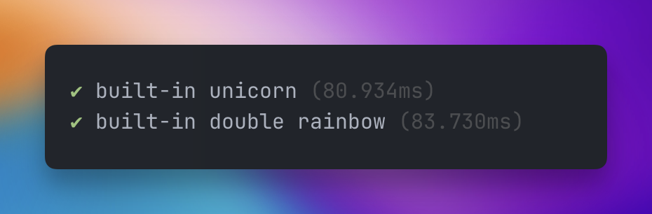

<div align="center">
	<h1 align="center">node-reporter-ava</h1>
	<h5>A custom test reporter for Node's built-in test runner, inspired by Ava</h5>
</div>

<br/>



## Installation

```bash
npm install -D node-reporter-ava
```

## Usage

```bash
node --test --test-reporter=node-reporter-ava
```
